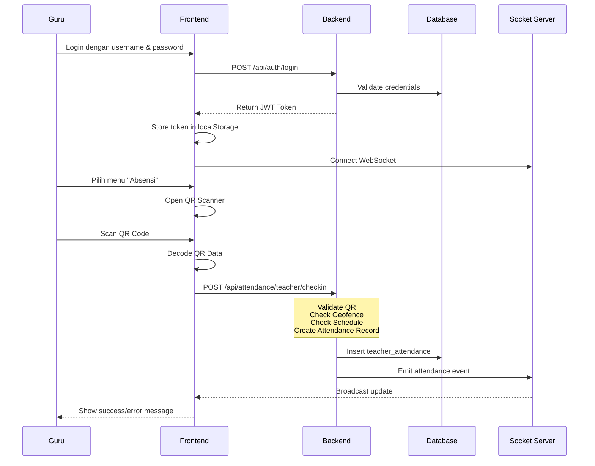
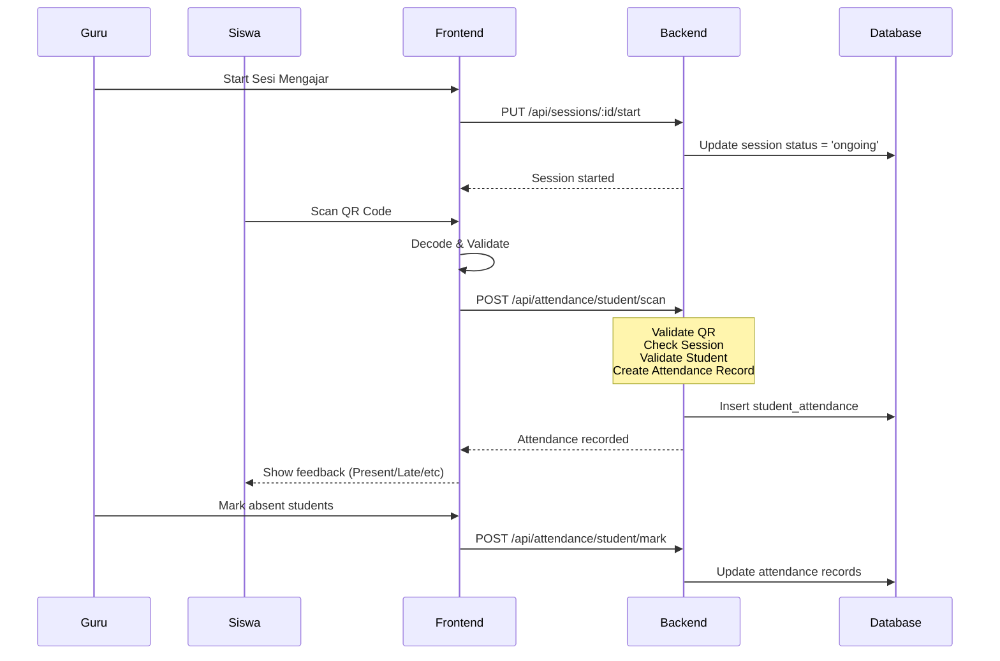

# PresensiApp - Sistem Absensi Sekolah

## 📖 Daftar Isi

1. [Tentang Aplikasi](#tentang-aplikasi)
2. [Stack Teknologi](#stack-teknologi)
3. [Arsitektur Sistem](#arsitektur-sistem)
4. [Fitur Utama](#fitur-utama)
5. [Struktur Database](#struktur-database)
6. [API Endpoints](#api-endpoints)
7. [Instalasi & Setup](#instalasi--setup)
8. [Cara Kerja Aplikasi](#cara-kerja-aplikasi)
9. [Panduan Penggunaan](#panduan-penggunaan)

---

## Tentang Aplikasi

**PresensiApp** adalah sistem manajemen absensi sekolah berbasis web dengan fitur lengkap untuk mencatat kehadiran guru dan siswa secara real-time. Aplikasi ini menggunakan teknologi QR Code dan Geofence untuk validasi kehadiran berbasis lokasi.

### Fitur Unggulan
- ✅ Absensi Guru & Siswa dengan QR Code
- ✅ Validasi Lokasi (Geofence)
- ✅ Jadwal Pelajaran Lengkap
- ✅ Real-time Updates (WebSocket)
- ✅ Laporan & Analitik
- ✅ Manajemen User & Kelas
- ✅ Support Guru Pengganti
- ✅ Tracking Keterlambatan

---

## Stack Teknologi

### Frontend
| Teknologi | Versi | Kegunaan |
|-----------|-------|----------|
| **React** | 19.2.0 | UI Framework |
| **TypeScript** | Latest | Type Safety |
| **Vite** | 7.2.4 | Build Tool |
| **Tailwind CSS** | 3.4.19 | Styling |
| **React Router** | 7.13.0 | Routing |
| **TanStack Query** | 5.90.20 | Data Fetching & Caching |
| **Socket.io Client** | 4.8.3 | Real-time Communication |
| **html5-qrcode** | Latest | QR Scanner |
| **Recharts** | Latest | Chart & Analytics |
| **Lucide React** | Latest | Icons |

### Backend
| Teknologi | Versi | Kegunaan |
|-----------|-------|----------|
| **Node.js** | Latest | Runtime |
| **Express** | 5.2.1 | Web Framework |
| **TypeScript** | Latest | Type Safety |
| **Sequelize** | 6.37.7 | ORM PostgreSQL |
| **PostgreSQL** | Latest | Database |
| **Socket.io** | 4.8.3 | WebSocket Server |
| **JWT** | 9.0.3 | Authentication |
| **Bcrypt** | Latest | Password Hashing |
| **Jest** | 30.2.0 | Testing |
| **Multer** | Latest | File Upload |

---

## Arsitektur Sistem

### Diagram Arsitektur

```
┌─────────────────────────────────────────────────────────────────┐
│                         CLIENT (Browser)                         │
│  ┌─────────────┐  ┌─────────────┐  ┌─────────────┐              │
│  │   React UI  │  │  QR Scanner │  │  Geolocation│              │
│  └──────┬──────┘  └──────┬──────┘  └──────┬──────┘              │
│         │                │                │                      │
│         └────────────────┴────────────────┘                      │
│                           │                                      │
│                    ┌──────▼──────┐                               │
│                    │ Axios + JWT │                               │
│                    │ Socket.io   │                               │
│                    └──────┬──────┘                               │
└───────────────────────────┼─────────────────────────────────────┘
                            │ HTTPS/WSS
                            ▼
┌─────────────────────────────────────────────────────────────────┐
│                      BACKEND (Node.js/Express)                  │
│  ┌─────────────┐  ┌─────────────┐  ┌─────────────┐              │
│  │    Routes   │  │ Middlewares │  │ Controllers │              │
│  └──────┬──────┘  └──────┬──────┘  └──────┬──────┘              │
│         │                │                │                      │
│         └────────────────┴────────────────┘                      │
│                           │                                      │
│                    ┌──────▼──────┐                               │
│                    │   Services  │                               │
│                    │   Models    │                               │
│                    └──────┬──────┘                               │
└───────────────────────────┼─────────────────────────────────────┘
                            │ Sequelize ORM
                            ▼
┌─────────────────────────────────────────────────────────────────┐
│                      DATABASE (PostgreSQL)                       │
│  users | teachers | students | classes | schedules | sessions   │
│  teacher_attendance | student_attendance | geofences | ...      │
└─────────────────────────────────────────────────────────────────┘
```

### Struktur Proyek

```
presensiapp2/
├── frontend/                   # React Frontend
│   ├── src/
│   │   ├── pages/             # Halaman utama
│   │   │   ├── Login.tsx
│   │   │   ├── GuruDashboard.tsx
│   │   │   ├── AdminDashboard.tsx
│   │   │   ├── SesiMengajar.tsx
│   │   │   ├── Rekap.tsx
│   │   │   └── ...
│   │   ├── components/        # Komponen reusable
│   │   │   ├── Scanner.tsx    # QR Scanner
│   │   │   ├── Sidebar.tsx
│   │   │   └── ...
│   │   ├── context/           # React Context
│   │   │   ├── AuthContext.tsx
│   │   │   └── SocketContext.tsx
│   │   ├── services/          # API Layer
│   │   │   ├── api.ts
│   │   │   └── adminApi.ts
│   │   └── hooks/             # Custom Hooks
│   └── package.json
│
├── backend/                    # Express Backend
│   ├── src/
│   │   ├── controllers/       # Business Logic
│   │   │   ├── authController.ts
│   │   │   ├── attendanceController.ts
│   │   │   ├── sessionController.ts
│   │   │   ├── qrController.ts
│   │   │   └── ...
│   │   ├── routes/            # API Endpoints
│   │   │   ├── authRoutes.ts
│   │   │   ├── attendanceRoutes.ts
│   │   │   └── ...
│   │   ├── models/            # Sequelize Models
│   │   │   ├── User.ts
│   │   │   ├── Teacher.ts
│   │   │   ├── Student.ts
│   │   │   └── index.ts
│   │   ├── middlewares/       # Express Middlewares
│   │   │   ├── auth.ts
│   │   │   ├── auditLog.ts
│   │   │   └── rateLimiter.ts
│   │   ├── services/          # Business Services
│   │   │   └── SessionManager.ts
│   │   ├── utils/             # Helper Functions
│   │   │   ├── jwt.ts
│   │   │   └── geofence.ts
│   │   ├── socket.ts          # Socket.io Setup
│   │   ├── server.ts          # Entry Point
│   │   └── config/
│   │       └── database.ts
│   ├── migrations/            # Database Migrations
│   ├── seeders/              # Database Seeders
│   ├── package.json
│   └── .env                   # Environment Variables
│
└── docs/                      # Dokumentasi
    └── DOKUMENTASI.md
```

---

## Fitur Utama

### 1. Sistem Autentikasi

- **Login dengan Username & Password**
- **Role-Based Access Control** (Admin, Teacher)
- **JWT Token Authentication**
- **Registrasi Publik dengan Token**

### 2. QR Code Attendance

#### QR Code Generator
- Generate QR untuk Kelas
- Generate QR untuk Tempat (Ruang Guru, Perpustakaan, dll)
- Generate QR untuk Siswa/Guru (ID Card)

#### QR Code Scanner
- Scan menggunakan kamera perangkat
- Validasi data QR secara real-time
- Feedback visual (sukses/gagal)

### 3. Geofence (Validasi Lokasi)

- **Setting Lokasi Sekolah** (Latitude, Longitude, Radius)
- **Validasi Jarak** menggunakan Haversine Formula
- **Toleransi Radius** dalam meter
- **Display Jarak** saat scan di luar area

### 4. Manajemen Jadwal

- **Jadwal Pelajaran** per kelas
- **Time Slot** sistem yang fleksibel
- **Pencegahan Konflik** jadwal
- **Jam Kerja Guru** per hari

### 5. Sesi Pembelajaran

- **Buat Sesi** dari jadwal
- **Status Sesi**: Scheduled → Ongoing → Completed/Cancelled
- **Guru Pengganti** (Substitute Teacher)
- **Real-time Updates**

### 6. Absensi Guru

#### Mode Absensi
- **Regular**: Absensi harian tanpa sesi
- **Session-Based**: Absensi per sesi pelajaran

#### Status Kehadiran
- `present` - Hadir tepat waktu
- `late` - Terlambat (dengan hitungan menit)
- `absent` - Tidak hadir
- `sick` - Sakit
- `permission` - Izin
- `alpha` - Tanpa keterangan

#### Fitur Tambahan
- Check-in & Check-out time
- Location tracking (latitude, longitude)
- Late minutes calculation
- Early checkout detection

### 7. Absensi Siswa

- **Per Sesi Pelajaran**, bukan per hari
- Status: Present, Absent, Sick, Permission, Late
- **Marked by** (guru yang mencatat)
- **Auto-fill Alpha** untuk sesi yang terlewat

### 8. Laporan & Analitik

- **Dashboard Real-time**
- **Export PDF & Excel**
- **Statistik Kehadiran**
- **Grafik Visual** dengan Recharts
- **Riwayat Aktivitas**

### 9. Manajemen User

- **CRUD Users** (Admin only)
- **Registrasi Guru** dengan token
- **Activity Logging** (audit trail)
- **Soft Delete** dengan isActive flag

### 10. Fitur Tambahan

- **Hari Libur** (Holiday Events)
- **Backup Database**
- **Cron Jobs** untuk auto-fill alpha
- **Rate Limiting** untuk security
- **CORS Configuration**

---

## Struktur Database

### Entity Relationship Diagram

```
┌─────────────┐         ┌─────────────┐
│    users    │────────▶│  teachers   │
│ (auth)      │ 1:1     │ (profile)   │
└─────────────┘         └──────┬──────┘
                               │
         ┌─────────────────────┼─────────────────────┐
         │                     │                     │
         ▼                     ▼                     ▼
┌──────────────┐      ┌──────────────┐      ┌──────────────┐
│   classes    │      │  schedules   │      │teacher_att.  │
│ (homeroom)   │1:N   │ (jadwal)     │1:N   │(absensi guru)│
└──────┬───────┘      └──────┬───────┘      └──────────────┘
       │                     │
       │1:N                  │1:N
       ▼                     ▼
┌──────────────┐      ┌──────────────┐
│  students    │      │   sessions   │
│ (siswa)      │      │ (sesi)       │
└──────────────┘      └──────┬───────┘
                             │
                             │1:N
                             ▼
                    ┌──────────────┐
                    │student_att.  │
                    │(absensi siswa)│
                    └──────────────┘
```

### Tabel Utama

#### users
| Kolom | Tipe | Deskripsi |
|-------|------|-----------|
| id | SERIAL | Primary Key |
| username | VARCHAR(50) | Unique, Login ID |
| password | VARCHAR(255) | Hashed Password |
| role | ENUM | 'admin', 'teacher' |
| name | VARCHAR(100) | Nama lengkap |
| email | VARCHAR(100) | Unique, Email |
| isActive | BOOLEAN | Status aktif |
| createdAt | TIMESTAMP | Waktu dibuat |
| updatedAt | TIMESTAMP | Waktu diupdate |

#### teachers
| Kolom | Tipe | Deskripsi |
|-------|------|-----------|
| id | SERIAL | Primary Key |
| userId | INTEGER | FK ke users (1:1) |
| employeeId | VARCHAR(20) | NIP/NUPTK, Unique |
| phone | VARCHAR(20) | No. HP |
| createdAt | TIMESTAMP | Waktu dibuat |
| updatedAt | TIMESTAMP | Waktu diupdate |

#### classes
| Kolom | Tipe | Deskripsi |
|-------|------|-----------|
| id | SERIAL | Primary Key |
| name | VARCHAR(50) | Nama kelas (e.g., "X-A") |
| level | INTEGER | Tingkat (10, 11, 12) |
| academicYear | VARCHAR(20) | Tahun ajaran |
| homeroomTeacherId | INTEGER | FK ke teachers |
| qrCodeData | TEXT | QR Code data |
| createdAt | TIMESTAMP | Waktu dibuat |
| updatedAt | TIMESTAMP | Waktu diupdate |

#### students
| Kolom | Tipe | Deskripsi |
|-------|------|-----------|
| id | SERIAL | Primary Key |
| nis | VARCHAR(20) | Nomor Induk Siswa, Unique |
| name | VARCHAR(100) | Nama lengkap |
| classId | INTEGER | FK ke classes |
| dateOfBirth | DATE | Tanggal lahir |
| gender | CHAR(1) | 'M' atau 'F' |
| createdAt | TIMESTAMP | Waktu dibuat |
| updatedAt | TIMESTAMP | Waktu diupdate |

#### subjects
| Kolom | Tipe | Deskripsi |
|-------|------|-----------|
| id | SERIAL | Primary Key |
| code | VARCHAR(20) | Kode mapel, Unique |
| name | VARCHAR(100) | Nama mapel |
| description | TEXT | Deskripsi |
| createdAt | TIMESTAMP | Waktu dibuat |
| updatedAt | TIMESTAMP | Waktu diupdate |

#### schedules
| Kolom | Tipe | Deskripsi |
|-------|------|-----------|
| id | SERIAL | Primary Key |
| teacherId | INTEGER | FK ke teachers |
| classId | INTEGER | FK ke classes |
| subjectId | INTEGER | FK ke subjects |
| dayOfWeek | INTEGER | 1-7 (Senin-Minggu) |
| startTime | TIME | Jam mulai |
| endTime | TIME | Jam selesai |
| room | VARCHAR(50) | Ruangan |
| academicYear | VARCHAR(20) | Tahun ajaran |
| isActive | BOOLEAN | Status aktif |
| createdAt | TIMESTAMP | Waktu dibuat |
| updatedAt | TIMESTAMP | Waktu diupdate |

#### sessions
| Kolom | Tipe | Deskripsi |
|-------|------|-----------|
| id | SERIAL | Primary Key |
| scheduleId | INTEGER | FK ke schedules |
| date | DATE | Tanggal sesi |
| startTime | TIME | Jam mulai sesi |
| endTime | TIME | Jam selesai sesi |
| status | ENUM | 'scheduled', 'ongoing', 'completed', 'cancelled' |
| substituteTeacherId | INTEGER | FK ke teachers (pengganti) |
| topic | VARCHAR(255) | Topik pembahasan |
| notes | TEXT | Catatan |
| createdAt | TIMESTAMP | Waktu dibuat |
| updatedAt | TIMESTAMP | Waktu diupdate |

#### teacher_attendance
| Kolom | Tipe | Deskripsi |
|-------|------|-----------|
| id | SERIAL | Primary Key |
| teacherId | INTEGER | FK ke teachers |
| sessionId | INTEGER | FK ke sessions (nullable) |
| date | DATE | Tanggal absensi |
| checkInTime | TIME | Waktu check-in |
| checkOutTime | TIME | Waktu check-out |
| status | ENUM | 'present', 'absent', 'sick', 'permission', 'late', 'alpha' |
| lateMinutes | INTEGER | Menit terlambat |
| earlyCheckoutMinutes | INTEGER | Menit pulang awal |
| latitude | DECIMAL(10,8) | Lokasi check-in |
| longitude | DECIMAL(11,8) | Lokasi check-in |
| notes | TEXT | Catatan |
| assignmentText | TEXT | Tugas/penugasan |
| attachmentUrl | VARCHAR(500) | Lampiran |
| createdAt | TIMESTAMP | Waktu dibuat |
| updatedAt | TIMESTAMP | Waktu diupdate |

#### student_attendance
| Kolom | Tipe | Deskripsi |
|-------|------|-----------|
| id | SERIAL | Primary Key |
| studentId | INTEGER | FK ke students |
| sessionId | INTEGER | FK ke sessions |
| status | ENUM | 'present', 'absent', 'sick', 'permission', 'late' |
| markedAt | TIMESTAMP | Waktu dicatat |
| markedBy | INTEGER | FK ke users |
| notes | TEXT | Catatan |
| createdAt | TIMESTAMP | Waktu dibuat |
| updatedAt | TIMESTAMP | Waktu diupdate |

#### geofences
| Kolom | Tipe | Deskripsi |
|-------|------|-----------|
| id | SERIAL | Primary Key |
| label | VARCHAR | Nama lokasi |
| latitude | DECIMAL(10,7) | Lintang |
| longitude | DECIMAL(10,7) | Bujur |
| radiusMeters | INTEGER | Radius validasi |
| isActive | BOOLEAN | Status aktif |
| createdAt | TIMESTAMP | Waktu dibuat |
| updatedAt | TIMESTAMP | Waktu diupdate |

#### registration_tokens
| Kolom | Tipe | Deskripsi |
|-------|------|-----------|
| token | UUID | Primary Key |
| description | VARCHAR | Keterangan |
| maxUses | INTEGER | Maksimal penggunaan |
| usedCount | INTEGER | Jumlah terpakai |
| expiresAt | DATE | Kadaluarsa |
| isActive | BOOLEAN | Status aktif |
| role | VARCHAR | Role yang ditetapkan |
| createdAt | TIMESTAMP | Waktu dibuat |
| updatedAt | TIMESTAMP | Waktu diupdate |

---

## API Endpoints

### Authentication

| Method | Endpoint | Deskripsi |
|--------|----------|-----------|
| POST | `/api/auth/login` | Login user |
| POST | `/api/auth/register` | Registrasi dengan token |
| POST | `/api/auth/logout` | Logout user |
| GET | `/api/auth/me` | Get current user |

### Users (Admin Only)

| Method | Endpoint | Deskripsi |
|--------|----------|-----------|
| GET | `/api/admin/users` | List all users |
| POST | `/api/admin/users` | Create new user |
| PUT | `/api/admin/users/:id` | Update user |
| DELETE | `/api/admin/users/:id` | Delete user |
| POST | `/api/admin/tokens` | Generate registration token |

### Classes

| Method | Endpoint | Deskripsi |
|--------|----------|-----------|
| GET | `/api/classes` | List all classes |
| GET | `/api/classes/:id` | Get class detail |
| POST | `/api/classes` | Create class |
| PUT | `/api/classes/:id` | Update class |
| DELETE | `/api/classes/:id` | Delete class |

### Students

| Method | Endpoint | Deskripsi |
|--------|----------|-----------|
| GET | `/api/students` | List all students |
| GET | `/api/students/:id` | Get student detail |
| POST | `/api/students` | Create student |
| PUT | `/api/students/:id` | Update student |
| DELETE | `/api/students/:id` | Delete student |
| GET | `/api/students/class/:classId` | Get students by class |

### Teachers

| Method | Endpoint | Deskripsi |
|--------|----------|-----------|
| GET | `/api/teachers` | List all teachers |
| GET | `/api/teachers/:id` | Get teacher detail |
| PUT | `/api/teachers/:id` | Update teacher profile |

### Subjects

| Method | Endpoint | Deskripsi |
|--------|----------|-----------|
| GET | `/api/subjects` | List all subjects |
| GET | `/api/subjects/:id` | Get subject detail |
| POST | `/api/subjects` | Create subject |
| PUT | `/api/subjects/:id` | Update subject |
| DELETE | `/api/subjects/:id` | Delete subject |

### Schedules

| Method | Endpoint | Deskripsi |
|--------|----------|-----------|
| GET | `/api/schedules` | List all schedules |
| GET | `/api/schedules/:id` | Get schedule detail |
| GET | `/api/schedules/teacher/:teacherId` | Get by teacher |
| GET | `/api/schedules/class/:classId` | Get by class |
| POST | `/api/schedules` | Create schedule |
| PUT | `/api/schedules/:id` | Update schedule |
| DELETE | `/api/schedules/:id` | Delete schedule |

### Sessions

| Method | Endpoint | Deskripsi |
|--------|----------|-----------|
| GET | `/api/sessions` | List all sessions |
| GET | `/api/sessions/:id` | Get session detail |
| GET | `/api/sessions/today` | Get today's sessions |
| POST | `/api/sessions` | Create session |
| PUT | `/api/sessions/:id` | Update session |
| PUT | `/api/sessions/:id/start` | Start session |
| PUT | `/api/sessions/:id/complete` | Complete session |
| DELETE | `/api/sessions/:id` | Delete session |

### Attendance - Teachers

| Method | Endpoint | Deskripsi |
|--------|----------|-----------|
| POST | `/api/attendance/teacher/checkin` | Check-in with QR |
| POST | `/api/attendance/teacher/checkout` | Check-out |
| GET | `/api/attendance/teacher/today` | Get today's attendance |
| GET | `/api/attendance/teacher/history` | Get attendance history |
| POST | `/api/attendance/teacher/manual` | Manual attendance entry |

### Attendance - Students

| Method | Endpoint | Deskripsi |
|--------|----------|-----------|
| POST | `/api/attendance/student/scan` | Scan student QR |
| GET | `/api/attendance/student/session/:sessionId` | Get by session |
| POST | `/api/attendance/student/mark` | Mark attendance |
| PUT | `/api/attendance/student/:id` | Update attendance |

### QR Code

| Method | Endpoint | Deskripsi |
|--------|----------|-----------|
| GET | `/api/qr/classes` | Generate class QR |
| GET | `/api/qr/students/:id` | Generate student QR |
| GET | `/api/qr/teachers/:id` | Generate teacher QR |
| GET | `/api/qr/places` | Generate place QR |

### Geofence

| Method | Endpoint | Deskripsi |
|--------|----------|-----------|
| GET | `/api/geofence` | Get all geofences |
| POST | `/api/geofence` | Create geofence |
| PUT | `/api/geofence/:id` | Update geofence |
| DELETE | `/api/geofence/:id` | Delete geofence |
| POST | `/api/geofence/validate` | Validate location |

### Reports

| Method | Endpoint | Deskripsi |
|--------|----------|-----------|
| GET | `/api/reports/teacher` | Teacher attendance report |
| GET | `/api/reports/student` | Student attendance report |
| GET | `/api/reports/export/pdf` | Export PDF |
| GET | `/api/reports/export/excel` | Export Excel |

### Analytics

| Method | Endpoint | Deskripsi |
|--------|----------|-----------|
| GET | `/api/analytics/dashboard` | Dashboard stats |
| GET | `/api/analytics/attendance` | Attendance trends |
| GET | `/api/analytics/teachers` | Teacher performance |

---

## Instalasi & Setup

### Prerequisites

- Node.js (v18+)
- PostgreSQL (v14+)
- npm atau yarn

### 1. Clone Repository

```bash
git clone <repository-url>
cd presensiapp2
```

### 2. Setup Database

```bash
# Create PostgreSQL database
createdb presensi_db

# Create user
createuser presensi_user
psql -c "ALTER USER presensi_user PASSWORD 'presensi_password';"
psql -c "GRANT ALL PRIVILEGES ON DATABASE presensi_db TO presensi_user;"
```

### 3. Setup Backend

```bash
cd backend

# Install dependencies
npm install

# Copy environment file
cp .env.example .env

# Edit .env with your configuration
```

#### backend/.env

```env
NODE_ENV=development
PORT=5000

# Database
DB_HOST=localhost
DB_PORT=5432
DB_NAME=presensi_db
DB_USER=presensi_user
DB_PASSWORD=presensi_password

# JWT
JWT_SECRET=your-super-secret-jwt-key-change-this-in-production
JWT_EXPIRES_IN=7d

# Geofence (Default school location)
GEOFENCE_LAT=-7.9708691437225365
GEOFENCE_LNG=112.7379056736653
GEOFENCE_RADIUS=100

# Working Hours (Default)
WORK_START_TIME=07:00
WORK_END_TIME=14:00

# Frontend URL (for CORS)
FRONTEND_URL=http://localhost:5173
```

```bash
# Run migrations
npm run migrate

# Seed database (optional)
npm run seed

# Start backend
npm run dev
```

### 4. Setup Frontend

```bash
cd ../frontend

# Install dependencies
npm install

# Start frontend
npm run dev
```

### 5. Docker Setup (Optional)

```bash
# Build and start all services
docker-compose up -d

# View logs
docker-compose logs -f

# Stop services
docker-compose down
```

---

## Cara Kerja Aplikasi

### Alur Absensi Guru



### Alur Absensi Siswa



### Validasi Geofence

```typescript
// Haversine Formula untuk menghitung jarak
function calculateDistance(
  lat1: number,
  lon1: number,
  lat2: number,
  lon2: number
): number {
  const R = 6371e3; // Earth radius in meters
  const φ1 = (lat1 * Math.PI) / 180;
  const φ2 = (lat2 * Math.PI) / 180;
  const Δφ = ((lat2 - lat1) * Math.PI) / 180;
  const Δλ = ((lon2 - lon1) * Math.PI) / 180;

  const a =
    Math.sin(Δφ / 2) * Math.sin(Δφ / 2) +
    Math.cos(φ1) * Math.cos(φ2) * Math.sin(Δλ / 2) * Math.sin(Δλ / 2);
  const c = 2 * Math.atan2(Math.sqrt(a), Math.sqrt(1 - a));

  return R * c; // Distance in meters
}

// Validasi geofence
function validateGeofence(
  userLat: number,
  userLon: number,
  fenceLat: number,
  fenceLon: number,
  radiusMeters: number
): { valid: boolean; distance: number } {
  const distance = calculateDistance(userLat, userLon, fenceLat, fenceLon);
  return {
    valid: distance <= radiusMeters,
    distance: Math.round(distance),
  };
}
```

### Format QR Code

#### QR Kelas
```json
{
  "type": "class",
  "id": 1,
  "name": "X-A",
  "timestamp": "2025-01-15T07:00:00Z"
}
```

#### QR Siswa
```json
{
  "type": "student",
  "id": 15,
  "nis": "1001",
  "name": "Ahmad Dahlan",
  "classId": 1
}
```

#### QR Guru
```json
{
  "type": "teacher",
  "id": 5,
  "employeeId": "G001",
  "name": "Budi Santoso"
}
```

### Flow Auto-fill Alpha (Cron Job)

```javascript
// Runs every day at 23:59
cron.schedule('59 23 * * *', async () => {
  const today = new Date().toISOString().split('T')[0];

  // Get all completed sessions today without attendance for all students
  const sessions = await Session.findAll({
    where: {
      date: today,
      status: 'completed'
    },
    include: [{
      model: Schedule,
      include: [{
        model: Class,
        include: [{
          model: Student,
          where: { id: { [Op.notIn]: [attendedStudentIds] } }
        }]
      }]
    }]
  });

  // Mark all absent students as 'alpha'
  for (const session of sessions) {
    for (const student of session.schedule.class.students) {
      await StudentAttendance.create({
        studentId: student.id,
        sessionId: session.id,
        status: 'alpha',
        markedAt: new Date(),
        markedBy: null // System marked
      });
    }
  }
});
```

---

## Panduan Penggunaan

### Untuk Admin

#### 1. Login
1. Buka aplikasi di browser
2. Masukkan username dan password admin
3. Klik tombol "Login"

#### 2. Generate Token Registrasi Guru
1. Masuk ke menu **Settings** → **Registration Tokens**
2. Klik **Generate New Token**
3. Set deskripsi, maksimal penggunaan, dan masa berlaku
4. Salin token dan berikan ke guru untuk registrasi

#### 3. Kelola Kelas
1. Masuk ke menu **Classes**
2. Klik **Add Class** untuk membuat kelas baru
3. Isi nama kelas, tingkat, tahun ajaran, dan wali kelas
4. Klik **Generate QR** untuk membuat QR Code kelas

#### 4. Kelola Jadwal
1. Masuk ke menu **Schedule**
2. Pilih kelas dan hari
3. Tambahkan jadwal dengan mengisi guru, mapel, jam, dan ruangan
4. Sistem akan mencegah konflik jadwal

#### 5. Atur Geofence
1. Masuk ke menu **Settings** → **Geofence**
2. Masukkan koordinat lokasi sekolah
3. Set radius dalam meter
4. Test lokasi dengan fitur "Check Location"

#### 6. Lihat Laporan
1. Masuk ke menu **Reports**
2. Pilih jenis laporan dan rentang waktu
3. Klik **Export PDF** atau **Export Excel**

### Untuk Guru

#### 1. Registrasi (Baru)
1. Buka halaman registrasi
2. Masukkan token dari admin
3. Isi data diri lengkap
4. Set username dan password
5. Tunggu persetujuan admin

#### 2. Login
1. Masukkan username dan password
2. Klik "Login"

#### 3. Absensi Harian
1. Masuk ke dashboard
2. Klik tombol "Scan QR" di bagian absensi
3. Scan QR di lokasi yang ditentukan
4. Pastikan berada dalam radius geofence
5. Absensi tercatat

#### 4. Mulai Sesi Mengajar
1. Masuk ke menu **Sesi Mengajar**
2. Pilih sesi yang akan dijalankan
3. Klik "Start Session"
4. Scan QR siswa satu per satu
5. Atau gunakan "Mark All Present" untuk semua siswa

#### 5. Tutup Sesi
1. Setelah selesai mengajar
2. Klik "Complete Session"
3. Isi catatan dan topik pembahasan
4. Siswa yang tidak hadir otomatis ditandai alpha

#### 6. Lihat Jadwal
1. Masuk ke menu **Jadwal**
2. Lihat jadwal mingguan
3. Jadwal di-highlight untuk hari ini

#### 7. Lihat Riwayat Absensi
1. Masuk ke menu **Rekap**
2. Lihat riwayat kehadiran
3. Download bukti absensi jika diperlukan

### Untuk Siswa

#### 1. Absensi di Kelas
1. Saat guru memulai sesi
2. Scan QR Code yang disediakan guru
3. Tunggu konfirmasi kehadiran
4. Status tercatat real-time

---

## Troubleshooting

### Common Issues

#### 1. QR Scanner tidak berfungsi
- Pastikan izin kamera diberikan
- Gunakan HTTPS atau localhost
- Pastikan pencahayaan cukup
- Coba gunakan browser berbeda (Chrome/Firefox)

#### 2. Geofence gagal
- Pastikan GPS aktif
- Izin lokasi diberikan
- Cek koordinat di settings admin
- Periksa radius geofence

#### 3. Tidak bisa login
- Cek koneksi internet
- Pastikan username dan password benar
- Hubungi admin jika akun dinonaktifkan

#### 4. Session tidak muncul
- Pastikan jadwal sudah dibuat admin
- Cek tanggal hari ini
- Refresh halaman

---

## Lisensi

© 2025 PresensiApp. All rights reserved.

---

*Dokumentasi ini dibuat untuk memudahkan pemahaman dan penggunaan sistem PresensiApp.*
